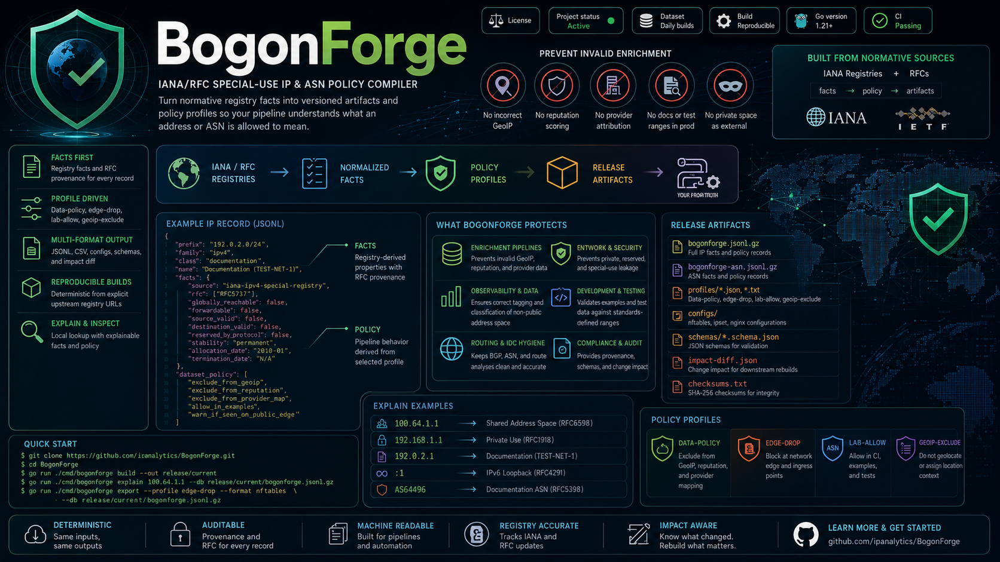

# BogonForge

BogonForge is a reproducible compiler for IANA/RFC special-use IP and ASN policy. It turns normative registry facts into versioned artifacts that enrichment, GeoIP, reputation, routing, SIEM, and data-quality pipelines can consume before assigning meaning to an address or ASN.

Most bogon lists tell you what to filter.

BogonForge tells your pipeline what an address is allowed to mean.

It prevents documentation, private, loopback, link-local, reserved, and special-use address space from being incorrectly geolocated, scored as reputation data, mapped to providers, or treated as external infrastructure.

<p align="center">
  
</p>

<p align="center">
  <a href="./LICENSE"></a>
  
  
  
  
  <a href="./.github/workflows/ci.yml"></a>
</p>

---

## Overview

BogonForge sits at the front of IP intelligence and network data pipelines. For every special-use prefix or ASN, it preserves the registry facts, derives profile-specific policy, and emits release artifacts with provenance.

The primary use case is not packet filtering. It is preventing invalid enrichment:

- documentation prefixes entering threat feeds
- private or shared address space receiving GeoIP attribution
- loopback and link-local addresses being treated as external infrastructure
- private, reserved, or documentation ASNs becoming provider identity
- CI fixtures and examples being rejected for using standards-defined test ranges

BogonForge provides the stable policy layer that downstream systems can check before continuing with ASN, GeoIP, reputation, or risk enrichment.

## System Behavior

```text
IANA / RFC registries
        |
        v
normalized facts
        |
        v
policy profiles
        |
        v
release artifacts, configs, schemas, impact diff
```

Facts and policy are intentionally separate. Facts come from IANA/RFC sources. Policy is derived from profiles for a specific operational context.

| Layer | Purpose | Examples |
| --- | --- | --- |
| Facts | Registry-derived properties | `source_valid`, `destination_valid`, `forwardable`, `globally_reachable`, `reserved_by_protocol`, `rfc` |
| Policy | Pipeline behavior | `exclude_from_geoip`, `exclude_from_reputation`, `exclude_from_provider_map`, `allow_in_examples` |
| Artifacts | Machine-consumable output | JSONL, CSV, profile files, nftables/ipset/nginx configs, schemas, impact diff |

## Features

- Compiles IPv4 and IPv6 IANA special-purpose registries
- Compiles IANA special-purpose AS numbers
- Preserves RFC provenance per record
- Emits JSONL and CSV datasets for IP and ASN records
- Produces `data-policy`, `edge-drop`, `lab-allow`, and `geoip-exclude` profiles
- Exports edge-oriented configs for nftables, ipset, and nginx
- Provides local `inspect` and `explain` lookups from compiled artifacts
- Emits `impact-diff.json` for downstream rebuild decisions
- Ships JSON schemas for generated records and profile output
- Builds deterministically from explicit upstream registry URLs

## Quick Start

```bash
git clone https://github.com/ipanalytics/bogonforge.git
cd bogonforge

go test ./...
go run ./cmd/bogonforge build --out release/current
go run ./cmd/bogonforge explain 100.64.1.1 --db release/current/bogonforge.jsonl.gz
```

Example output:

```text
IP: 100.64.1.1 -> 100.64.0.0/10
Class: shared-address-space (RFC6598, iana-ipv4-special-registry)
Name: Shared Address Space
Facts: globally_reachable=false forwardable=true source_valid=true destination_valid=true reserved_by_protocol=false
Policy: exclude_from_geoip, exclude_from_reputation, exclude_from_provider_map
```

## Installation

BogonForge is a Go CLI.

```bash
go install https://github.com/ipanalytics/BogonForge/cmd/bogonforge@latest
```

For local development:

```bash
go build ./cmd/bogonforge
./bogonforge build --out release/current
```

## Usage

Build a release:

```bash
bogonforge build --out release/current
```

Inspect an address:

```bash
bogonforge inspect 192.0.2.1 --db release/current/bogonforge.jsonl.gz
```

Export an edge-drop nftables set:

```bash
bogonforge export \
  --profile edge-drop \
  --format nftables \
  --db release/current/bogonforge.jsonl.gz
```

Validate a release:

```bash
bogonforge validate release/current
```

Compare two releases:

```bash
bogonforge diff release/previous release/current
```

## Outputs

A build writes a release directory with datasets, profiles, configs, schemas, metadata, and checksums.

```text
release/current/
├── bogonforge.jsonl.gz
├── bogonforge.csv.gz
├── bogonforge-asn.jsonl.gz
├── bogonforge-asn.csv.gz
├── profiles/
│   ├── data-policy.json
│   ├── edge-drop.txt
│   ├── lab-allow.txt
│   └── geoip-exclude.txt
├── configs/
│   ├── nftables-set.nft
│   ├── ipset.restore
│   └── nginx-deny.conf
├── schemas/
│   ├── special-ip.schema.json
│   ├── special-asn.schema.json
│   └── policy-profile.schema.json
├── metadata.json
├── impact-diff.json
├── quality-report.md
└── checksums.txt
```

| Artifact | Consumers |
| --- | --- |
| `bogonforge.jsonl.gz` | enrichment services, batch pipelines, local explain lookup |
| `bogonforge-asn.jsonl.gz` | ASN attribution, route hygiene, provider identity checks |
| `profiles/data-policy.json` | GeoIP, reputation, fraud/risk, observability datasets |
| `profiles/edge-drop.txt` | firewalls, ingress filters, edge allow/deny logic |
| `profiles/lab-allow.txt` | CI, fixtures, examples, documentation linting |
| `impact-diff.json` | release automation and downstream rebuild decisions |

## Data Format

Each IP record separates registry facts from derived policy:

```json
{
  "prefix": "192.0.2.0/24",
  "family": "ipv4",
  "class": "documentation",
  "name": "Documentation (TEST-NET-1)",
  "facts": {
    "source": "iana-ipv4-special-registry",
    "rfc": ["RFC5737"],
    "globally_reachable": false,
    "forwardable": false,
    "source_valid": false,
    "destination_valid": false,
    "reserved_by_protocol": false,
    "stability": "permanent",
    "allocation_date": "2010-01",
    "termination_date": "N/A"
  },
  "dataset_policy": [
    "exclude_from_geoip",
    "exclude_from_reputation",
    "exclude_from_provider_map",
    "allow_in_examples",
    "warn_if_seen_on_public_edge"
  ]
}
```

ASN records use the same pattern:

```json
{
  "asn_range": "64496-64511",
  "class": "documentation",
  "reason": "For documentation and sample code; reserved by [RFC5398]",
  "facts": {
    "source": "iana-as-numbers-special-registry",
    "rfc": ["RFC5398"],
    "stability": "permanent"
  },
  "dataset_policy": [
    "exclude_from_public_asn_identity",
    "allow_in_examples"
  ]
}
```

## Source Registries

BogonForge defaults to official IANA CSV registry endpoints.

| Registry | Source |
| --- | --- |
| IPv4 Special-Purpose Address Space | `https://www.iana.org/assignments/iana-ipv4-special-registry/iana-ipv4-special-registry-1.csv` |
| IPv6 Special-Purpose Address Space | `https://www.iana.org/assignments/iana-ipv6-special-registry/iana-ipv6-special-registry-1.csv` |
| Special-Purpose AS Numbers | `https://www.iana.org/assignments/iana-as-numbers-special-registry/special-purpose-as-numbers.csv` |

Custom source URLs may be passed to `build` for pinned mirrors or offline release pipelines:

```bash
bogonforge build \
  --ipv4-url https://mirror.example.net/iana-ipv4-special-registry-1.csv \
  --ipv6-url https://mirror.example.net/iana-ipv6-special-registry-1.csv \
  --asn-url  https://mirror.example.net/special-purpose-as-numbers.csv \
  --out release/current
```

## Operational Notes

Special-use registries change slowly. A weekly stable build is usually sufficient for production pipelines. Daily snapshots are reasonable for organizations that want early visibility into registry changes.

Recommended pipeline behavior:

```text
lookup address in BogonForge
  if special-use:
      attach explanation
      apply dataset policy
      stop incompatible enrichment
  else:
      continue ASN / GeoIP / reputation / risk enrichment
```

Use `impact-diff.json` to decide which downstream artifacts need rebuilds after a registry or policy change.

<details>
<summary>Example impact diff</summary>

```json
{
  "build_id": "20260524-143622Z",
  "semantic_changes": 1,
  "profile_impacts": {
    "data-policy": ["192.0.2.0/24"],
    "edge-drop": [],
    "lab-allow": ["192.0.2.0/24"]
  },
  "downstream_rebuild_recommended": [
    "GeoForge",
    "Blackroute",
    "ASNForge",
    "PrefixLint",
    "IntelMerge"
  ]
}
```

</details>

## Use Cases

- Exclude special-use ranges from GeoIP datasets
- Prevent documentation and private ranges from entering reputation systems
- Guard provider maps against reserved/private ASN identity
- Generate edge-drop configuration from registry-backed facts
- Permit standards-defined documentation ranges in examples and fixtures
- Add explainable special-use context to SIEM and observability events
- Drive downstream rebuilds when policy-impacting registry facts change

## Project Scope

BogonForge covers IANA/RFC special-use IP prefixes and special-purpose ASNs. It is a stable registry-backed layer for data and infrastructure pipelines.

Out of scope:

- live BGP visibility
- threat intelligence scoring
- GeoIP attribution
- Team Cymru fullbogons replacement
- maliciousness classification

## Limitations

- The current explain database is JSONL gzip. MMDB output is tracked as a release target but is not emitted by this implementation yet.
- Config artifacts are generated mechanically and should be integrated through the normal review path for each environment.
- Policy profiles are intentionally conservative and small; downstream systems may layer stricter local policy.

## Directory Structure

```text
.
├── cmd/bogonforge/          # CLI entrypoint
├── internal/bogonforge/     # compiler, policy, artifacts, lookup, diff
├── schemas/                 # JSON schemas copied into releases
├── site/                    # repository visual assets
├── release/                 # generated output, ignored by git
└── .github/workflows/       # CI
```

## Deployment

For scheduled builds, run the compiler in CI or a controlled release job and publish the resulting `release/current` directory to object storage, GitHub Releases, or an internal artifact registry.

Minimal GitHub Actions shape:

```yaml
name: release

on:
  schedule:
    - cron: "0 3 * * 1"
  workflow_dispatch:

jobs:
  build:
    runs-on: ubuntu-latest
    steps:
      - uses: actions/checkout@v4
      - uses: actions/setup-go@v5
        with:
          go-version: "1.22"
      - run: go test ./...
      - run: go run ./cmd/bogonforge build --out release/current
      - run: go run ./cmd/bogonforge validate release/current
```

## License

BogonForge is licensed under the [Apache License 2.0](./LICENSE).

## Disclaimer

BogonForge compiles public registry data and derived policy artifacts for infrastructure and data-engineering use. Operators remain responsible for validating generated configs and policies before applying them in production environments.
